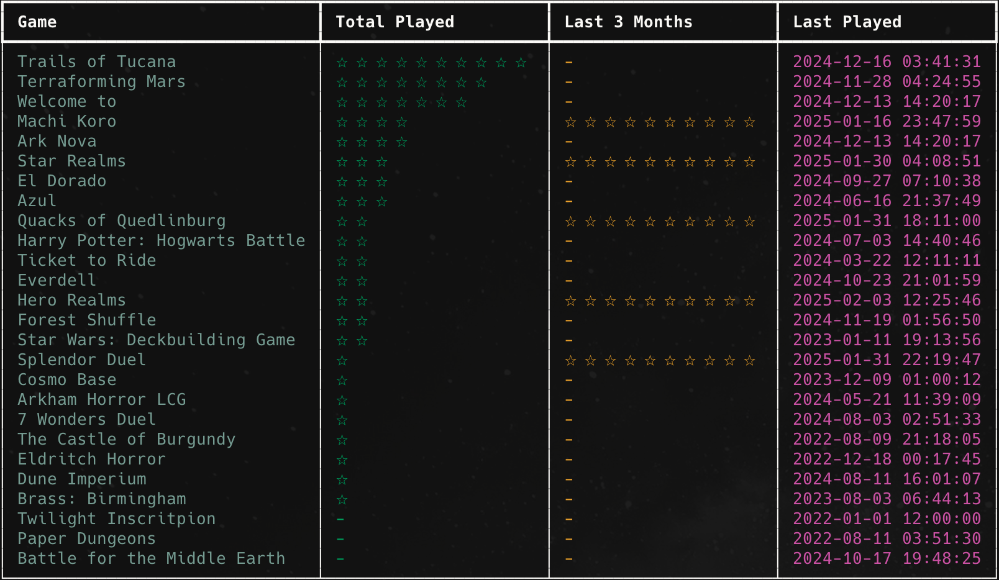

# Board Vault

Board Vault is a Python-based CLI tool to manage your board game collection, track play history, and generate game statistics.



## Prerequisites

Before running the script, ensure you have the following installed:
- Python 3.8+
- SQLite3

## Features
- Add a new game to your collection.
- Delete an existing game.
- Log a game session when you play a game.
- List all games in your collection.
- Generate statistics on total plays and recent plays (last 12 months).
- Sort stats by game, size, total plays, or last played.
- Show recommendations based on your rankings and play history.
- Import game data from a CSV file.
- Track game sizes (S, M, L, XL) for future scoring.

## Installation

1. Clone the repository:
   ```sh
   git clone https://github.com/Serhii-Prusak/BoardVault.git
   cd board-vault
   ```

2. Create a virtual environment and activate it:
   ```bash
   python -m venv .venv
   source .venv/bin/activate 
   ```

3. Install required dependencies:
   ```sh
   pip install -r requirements.txt
   ```

## Usage

Run the script with the following arguments:

```sh
python board-vault.py --stats [game|size|total|last-played]
python board-vault.py --list-games
python board-vault.py --add-new-game "Game Name"
python board-vault.py --delete-game "Game Name"
python board-vault.py --delete-game
python board-vault.py --play-game "Game Name"
python board-vault.py --play-game
python board-vault.py --import-games games.csv
python board-vault.py --recommend [--recent] [--neglected]
```

### Arguments
- `--stats` - Display statistics of games played (sortable by `game`, `size`, `total` plays, or `last-played`).
- `--list-games` - List all games in your collection.
- `--add-new-game` - Add a new game to the collection.
- `--delete-game` - Remove a game from the collection (confirmation required, omit the name to choose from a list).
- `--play-game` - Log a play session for a game (omit the name to choose from a list).
- `--import-games` - Import games and play data from a CSV file.
- `--recommend` - Show game recommendations based on rank vs plays.
- `--recent` - Use recent plays for recommendations.
- `--neglected` - Show neglected/never-played games.

## Example Usage
```sh
python board-vault.py --add-new-game "Catan"
python board-vault.py --play-game "Catan"
python board-vault.py --play-game
python board-vault.py --stats total
python board-vault.py --stats size
python board-vault.py --recommend --recent
python board-vault.py --delete-game "Catan"
```

## Database
The script uses an SQLite database to store:
- `games` table: Game names and IDs.
- `game_flow` table: Play history with timestamps.
- `sizes` table: Size and duration metadata for future scoring.

---
Enjoy tracking your board games with Board Vault! 🎲
